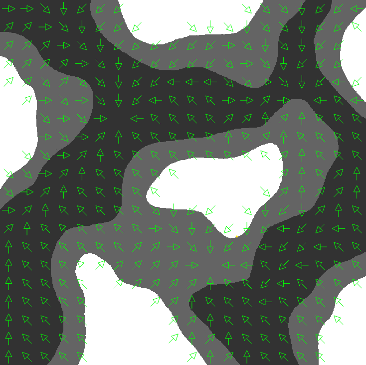
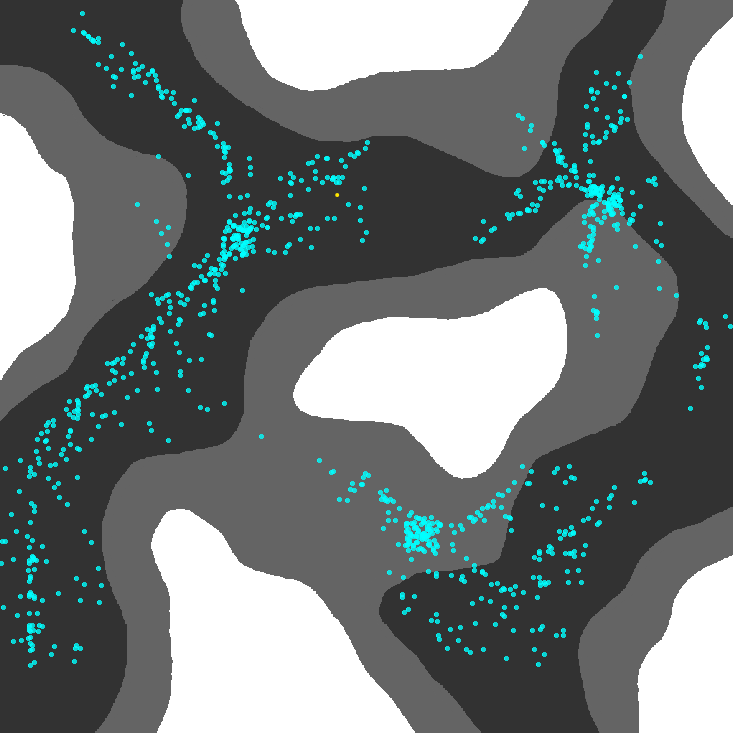
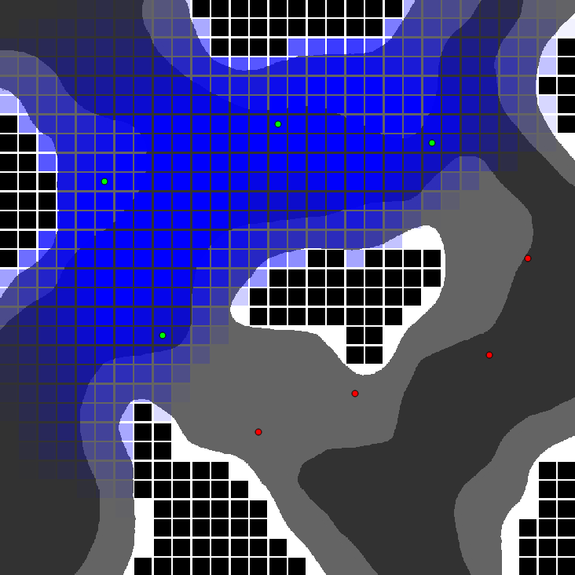
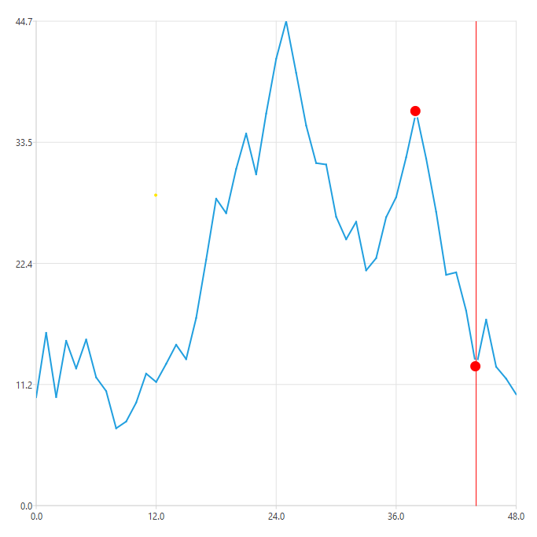
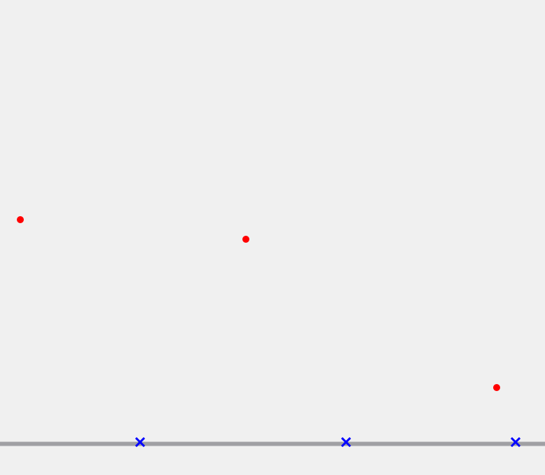

# AI for Games  

This repository contains example implementations for several AI algorithms used in game development scenarios.
The algorithms are visualized using the Qt-Framework.

Currently featured Topics are:

- Flow-Field Pathfinding
- Hill Climbing
- RQ-Learning
- Tactical Maps
- Ballistic Prediction

## Getting Started

To get started follow these steps:

1. Make sure [Qt](https://www.qt.io/download-dev) (Version 6.6.3) is installed on your system

2. Install the visual studio extension: [Qt Visual Studio Tools](https://marketplace.visualstudio.com/items?itemName=TheQtCompany.QtVisualStudioTools2022) and configure it for Qt version 6.6.3

3. Clone this repository to your machine
   ```bash
   git clone https://github.com/chFleschutz/ai-for-games.git
   ```

4. Open the solution in Visual Studio

5. Build and run


## Screenshots

### Flowfield Pathfinding

<div style="display: flex; justify-content: center;">
   
   
</div>

### Tactical Maps

<div style="display: flex; justify-content: center;">
   
   
</div>

### Hill Climbing



### Ballistic Prediction


